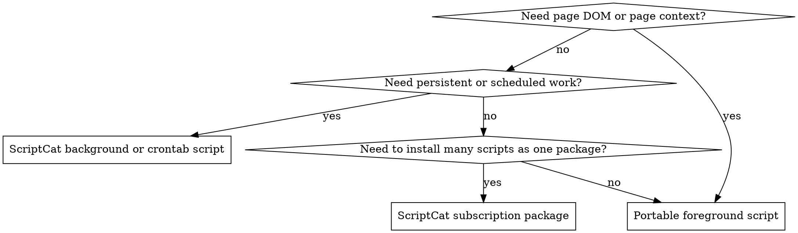

## Runtime Selection

```dot
digraph userscript_runtime {
    "Need page DOM or page context?" [shape=diamond];
    "Need persistent or scheduled work?" [shape=diamond];
    "Need to install many scripts as one package?" [shape=diamond];
    "Portable foreground script" [shape=box];
    "ScriptCat background or crontab script" [shape=box];
    "ScriptCat subscription package" [shape=box];

    "Need page DOM or page context?" -> "Portable foreground script" [label="yes"];
    "Need page DOM or page context?" -> "Need persistent or scheduled work?" [label="no"];
    "Need persistent or scheduled work?" -> "ScriptCat background or crontab script" [label="yes"];
    "Need persistent or scheduled work?" -> "Need to install many scripts as one package?" [label="no"];
    "Need to install many scripts as one package?" -> "ScriptCat subscription package" [label="yes"];
    "Need to install many scripts as one package?" -> "Portable foreground script" [label="no"];
}
```
